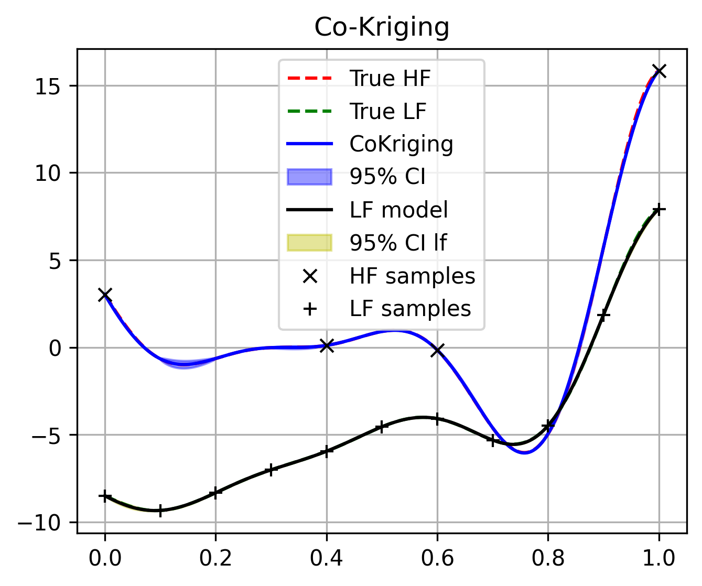

Multi fidelity surrogates 
==========================

Single fidelity surrogates such as Kriging model already showed incredible performance on expensive black-box function problems. 
However, for extremely expensive problems, the single fidelity surrogates may not be able to provide accurate prediction results 
due to the lack of samples. Commonly, we can easily get low-fidelity samples for the same problem, those low-fidelity samples is much 
cheaper but less accurate than the high-fidelity samples.

To make use of those low-fidelity samplers to enhance the prediction accuracy, 
multi-fidelity surrogates are proposedMulti-fidelity
GPs were initially developed by O'Hagan in the 1990s [1]_. 
The author considered an auto-regressive model and demonstrated the potential of 
reaching similar accuracy to conventional GPs while requiring less computational time. 
Other multi-fidelity formulations have been proposed as well, but multi-fidelity GPs can be roughly categorized in two 
groups: 

 (1) Auto-regression models and their extensions, like Co-Kriging model [1]_ 

 (2) Scaling-based multi-fidelity GPs [2]_

 (3) Others, like Hierarchical Kriging model [3]_ 

.. note::
  By the following, the basic of Co-Kriging model will be briedly introduced, and for 
  the details of other multi-fidelity surrogates, please refer to the original papers.

Co-Kriging model
----------------

1. basics of Co-Kriging model
~~~~~~~~~~~~~~~~~~~~~~~~~~~~~

The idea of auto-regression model can be expressed by [4]_ , which can be expressed as:

.. math:: 

   f_h \left ( \boldsymbol{x}   \right) =  \boldsymbol{\rho} f_l \left ( \boldsymbol{x}   \right) + f_d \left ( \boldsymbol{x}   \right) 

where the high-fidelity GP  :math:`f_h \left ( \boldsymbol{x}   \right)`
is the summation of two GPs (the low-fidelity :math:`f_l \left ( \boldsymbol{x}   \right)`
and the difference :math:`f_d \left ( \boldsymbol{x}   \right)`), 
and where :math:`\boldsymbol{\rho}` is  an additional hyper-parameter to 
control the correlation level between high-fidelity and low-fidelity. 
The auto-regression model expands the covariance matrix to the form of 

.. math:: 

  \mathcal{C} = \begin{pmatrix}
  \mathcal{K} \left( \boldsymbol{x}_h, \boldsymbol{x}_h \right) & \mathcal{K} \left( \boldsymbol{x}_h, \boldsymbol{x}_l \right)\\
  \mathcal{K} \left( \boldsymbol{x}_l, \boldsymbol{x}_h \right) & \mathcal{K} \left( \boldsymbol{x}_l, \boldsymbol{x}_l \right)
  \end{pmatrix}

2. Training and Inference
~~~~~~~~~~~~~~~~~~~~~~~~~

The training of Co-Kriging model consists of two stages. In the first stage, 
we can train a low fidelity Kriging model :attr:`~mfpml.models.GaussianProcessRegression` based on the low-fidelity samples. 
Then, combine the low-fidelity Kriging model and the high-fidelity samples, we can train a discrepancy Kriging model, and finding 
the best :math:`\boldsymbol{\rho}`. 

Implementation
--------------

The Co-Kriging model is implemented in :attr:`~mfpml.models.co_kriging.CoKriging` class.
The following example is given to illustrate the usage of the how to train and predict with Co-Kriging model:
  
.. code-block:: python

  # Import required libraries
  import matplotlib.pyplot as plt
  import numpy as np

  # Import necessary modules
  from mfpml.design_of_experiment.mf_samplers import MFSobolSequence
  from mfpml.models.co_kriging import CoKriging
  from mfpml.problems.mf_functions import Forrester_1b

  # Step 1: Define the Multi-Fidelity Function
  func = Forrester_1b()

  # Step 2: Generate Samples at Two Fidelity Levels
  sampler = MFSobolSequence(design_space=func._input_domain, num_fidelity=2)
  sample_x = sampler.get_samples(num_samples=[10, 100], seed=2)
  sample_y = func(sample_x)

  # Add noise to the samples
  np.random.seed(2)
  sample_y[0] += np.random.normal(0, 0.3, sample_y[0].shape)  # Low-fidelity noise
  sample_y[1] += np.random.normal(0, 0.3, sample_y[1].shape)  # High-fidelity noise

  # Step 3: Generate Test Data
  test_x = np.linspace(0, 1, 1000).reshape(-1, 1)
  test_hf_y = func.hf(test_x)  # High-fidelity ground truth
  test_lf_y = func.lf(test_x)  # Low-fidelity ground truth

  # Step 4: Train the Co-Kriging Model
  coK = CoKriging(design_space=func._input_domain, optimizer_restart=10, noise_prior=None)
  coK.train(sample_x, sample_y)

  # Step 5: Predictions
  cok_predictions, cok_std = coK.predict(test_x, return_std=True)

  # Step 6: Plot the Results
  fig, ax = plt.subplots(figsize=(6, 4))
  ax.plot(test_x, test_hf_y, "r--", label="True High-Fidelity")
  ax.plot(test_x, test_lf_y, "g--", label="True Low-Fidelity")
  ax.plot(test_x, cok_predictions, "b-", label="Co-Kriging Predictions")
  ax.fill_between(
      test_x[:, 0],
      cok_predictions[:, 0] - 1.96 * cok_std[:, 0],
      cok_predictions[:, 0] + 1.96 * cok_std[:, 0],
      alpha=0.4,
      color="b",
      label="95% Confidence Interval",
  )
  ax.scatter(sample_x[0], sample_y[0], color="green", label="Low-Fidelity Samples")
  ax.scatter(sample_x[1], sample_y[1], color="red", label="High-Fidelity Samples")
  ax.legend(loc="best")
  ax.grid("--")
  plt.xlabel("x")
  plt.ylabel("y")
  plt.title("Multi-Fidelity Co-Kriging Regression")
  plt.show()

  # Step 7: Print Training Information
  print(f"Low-Fidelity Training Time: {coK.lf_training_time:.4f} seconds")
  print(f"High-Fidelity Training Time: {coK.hf_training_time:.4f} seconds")

Implemented multi-fidelity surrogates
-------------------------------------

======================== ========================================================================================
Multifidelity surrogate                   API of sampling methods                                            
======================== ========================================================================================         
Co-Kriging                 :attr:`~mfpml.models.co_kriging.CoKriging`
Hierarchical Kriging       :attr:`~mfpml.models.hierarchical_kriging.HierarchicalKriging`
Scaled Kriging             :attr:`~mfpml.models.scale_kriging.ScaledKriging`
======================== ========================================================================================

References
----------

.. [1]

    Marc C Kennedy and Anthony O'Hagan. “Predicting the output from
    a complex computer code when fast approximations are available”. In:
    Biometrika 87.1 (2000), pp. 1~13.

.. [2]

    Chanyoung Park, Raphael T. Haftka, and Nam H. Kim. “Low-fidelity scale
    factor improves Bayesian multi-fidelity prediction by reducing bumpi-
    ness of discrepancy function”. In: Structural and Multidisciplinary Op-
    timization 58.2 (2018), pp. 399~414. 

.. [3]

    Han, Zhong-Hua, and Stefan Görtz. "Hierarchical kriging model for 
    variable-fidelity surrogate modeling." AIAA journal 50, no. 9 
    (2012): 1885-1896.
.. [4]
    
   Forrester, Alexander, Andras Sobester, and Andy Keane. Engineering 
   design via surrogate modelling: a practical guide. John Wiley & Sons, 2008.