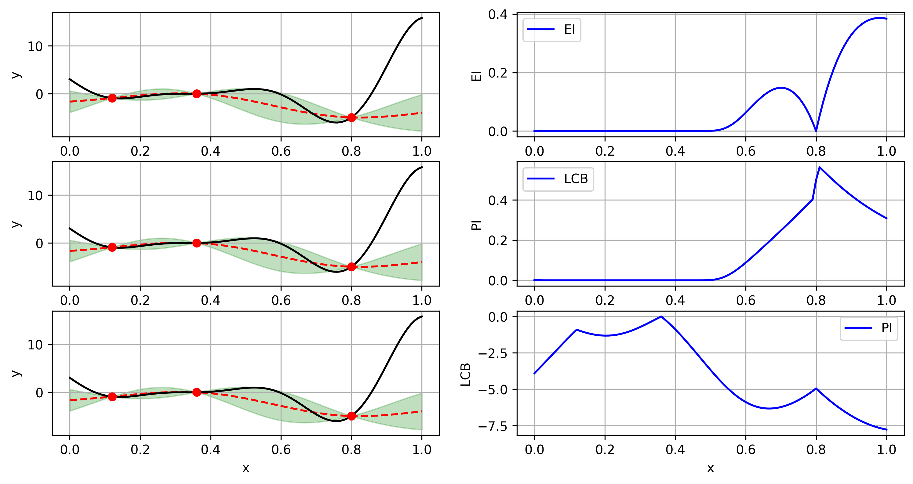
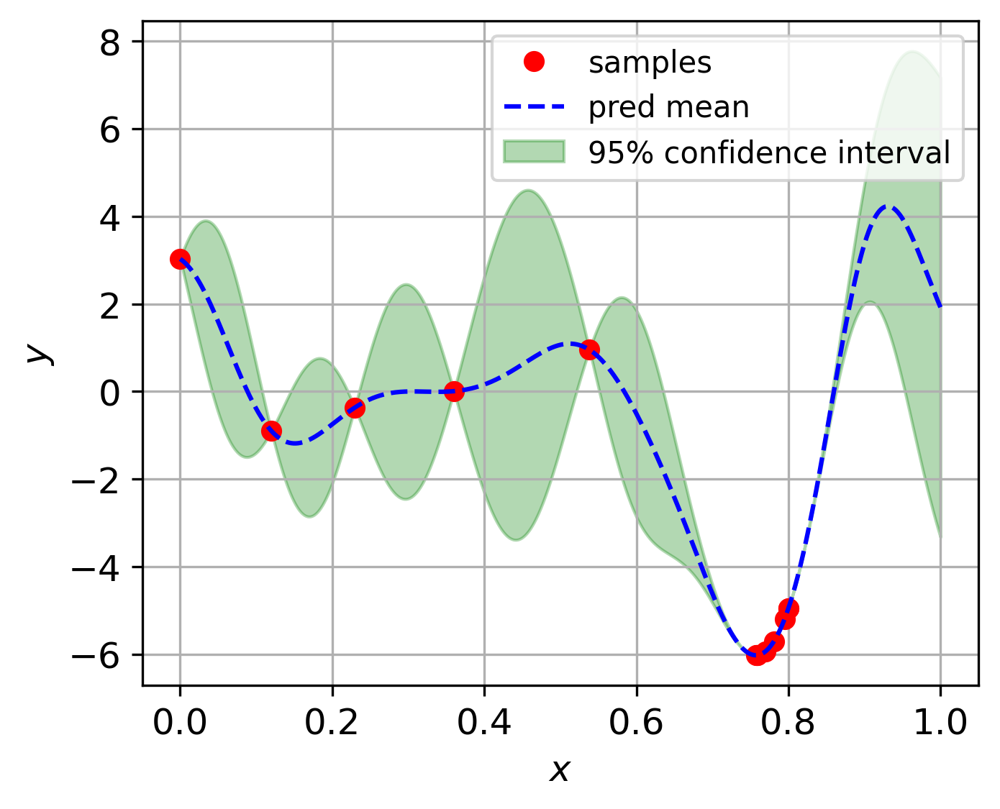

Optimization 
============

optimization is needed also everywhere in the field of machine learning, and also
in the field of product, structure, and material design. In this packages, we have 
implemented a few optimization algorithms, which can be categorized into two groups:

1. Evolutionary algorithms

2. Single fidelity Bayesian optimization

3. Multi fidelity Bayesian optimization

1. Evolutionary algorithms
==========================
Evolutionary is a class of algorithms inspired by the biological evolution, and they 
don't require the gradient information of the objective function. In this package, we 
have implemented the following evolutionary algorithms:

(1) particle swarm optimization (PSO)

(2) differential evolution (DE)

1.1 Particle swarm optimization
-------------------------------

Particle swarm optimization (PSO) is a population-based stochastic optimization algorithm.
The basic idea of PSO is to simulate the social behavior of birds flocking or fish schooling.
In PSO, each particle has a position and velocity, and the position of each particle is updated
according to certain rules. More details can be referred to [1]_

**Implementation**

.. code-block:: python

    from mfpml.problems.singlefidelity_functions import Forrester
    from mfpml.optimization.sf_pso import PSO
    # define problem 
    problem = Forrester()

    # initialize the PSO class
    pso = PSO(num_gen=100, num_pop=20)
    # run the optimizer
    best_results = pso.run_optimizer(
        func=problem.f,
        num_dim=problem.num_dim,
        design_space=problem._input_domain,
        print_info=False,
    )

1.2 Differential evolution
---------------------------

Differential evolution (DE) is a population-based stochastic optimization algorithm.
The basic idea of DE is to generate a new population by adding the weighted difference
between two randomly selected population members to a third population member. More details
can be referred to [2]_

**Implementation**

.. code-block:: python

    from mfpml.problems.singlefidelity_functions import Forrester
    from mfpml.optimization.sf_de import DE
    # define problem 
    problem = Forrester()

    # initialize the DE class
    de = DE(num_gen=100, num_pop=20)
    # run the optimizer
    best_results = de.run_optimizer(
        func=problem.f,
        num_dim=problem.num_dim,
        design_space=problem._input_domain,
        print_info=False,
    )

2. Bayesian optimization
========================
Bayesian optimization is a powerful tool to handling expensive optimization problems. 
The basic idea of Bayesian optimization is to use Gaussian Process model to approximate 
the objective function, and then use the predictive mean and variance to determine the next sampling location.

The criterion of Bayesian optimization is called acquisition function, which is a function of predictive mean and variance. 
The acquisition function is used to determine the next sampling location. There are several acquisition functions, 
such as Expected Improvement (EI), Probability of Improvement (PI), Lower Confidence Bound (UCB), and so on.

2.1 acquisition functions
-------------------------

**Expected Improvement (EI)**

.. math::

  EI(\mathbf{x}) = \mathbb{E}\left [ \max(0, \hat{f}(\mathbf{x}) - f(\mathbf{x}^+)) \right]

where :math:`\mathbf{x}^+` is the best observation so far. The above expression can be simplified as:

.. math:: 

  EI(\mathbf{x}) = \left\{
  \begin{aligned}
  &(\hat{f}(\mathbf{x}) - f(\mathbf{x}^+))\Phi(Z) + \hat{s}(\mathbf{x})\phi(Z), \,\, \hat{s}(\mathbf{x}) > 0\\
  &0, \,\, \hat{s}(\mathbf{x}) = 0
  \end{aligned}
  \right.
  \,\,

where :math:`\Phi` and :math:`\phi` are the cumulative distribution function and probability density 
function of standard normal distribution, respectively.

**Probability of Improvement (PI)**

.. math::

  PI(\mathbf{x}) = \mathbb{P}\left [ \hat{f}(\mathbf{x}) \geq f(\mathbf{x}^+) \right]

.. math:: 

  PI(\mathbf{x}) = \left\{
  \begin{aligned}
  &\Phi(Z), \,\, \hat{s}(\mathbf{x}) > 0\\
  &0, \,\, \hat{s}(\mathbf{x}) = 0
  \end{aligned}
  \right.
  \,\,
  where \,\, Z = \frac{\hat{f}(\mathbf{x}) - f(\mathbf{x}^+) }{\hat{s}(\mathbf{x})}

**Lower Confidence Bound (LCB)**

.. math:: 
  
    LCB(\mathbf{x}) = \hat{f}(\mathbf{x}) - \kappa \hat{s}(\mathbf{x})
  
where :math:`\kappa` is a hyper-parameter, which is usually set to be 2.

2.2 Schematics of Acquisition function on Forrester function
------------------------------------------------------------

   Schematics of acquisition function on Forrester function

2.3 Bayesian optimization implementation

.. code-block:: python
    
    from mfpml.problems.singlefidelity_functions import Forrester
    from mfpml.optimization.sfbo import BayesOpt
    from mfpml.optimization.sf_acqusitions import EI
    # define problem 
    problem = Forrester()
    # initialize the samples 
    x = np.array([[0.0], [0.5], [1.0]])
    y = problem.f(x)

    # initialize the BayesOpt class
    bo = BayesOpt(problem=problem)
    # note by changing acquistion, to lcb and ei, we can get different results
    bo.run_optimizer(init_x=x,
                    init_y=y,
                    max_iter=10,
                    surrogate=kriging,
                    acquisition=EI(),
                    print_info=False)

   Bayesian optimization on Forrester function

Implemented single fidelity acquisition functions
-------------------------------------------------

======================== ========================================================================================
Methods                   API of sampling methods                                            
======================== ========================================================================================         
Expected Improvement       :attr:`~mfpml.optimization.sf_acqusitions.EI`
Probability Improvement    :attr:`~mfpml.optimization.sf_acqusitions.PI`
Low Confidence Bound       :attr:`~mfpml.optimization.sf_acqusitions.LCB`
======================== ========================================================================================

3. Multi fidelity Bayesian optimization
=======================================
Multi fidelity Bayesian optimization is getting more popular nowadays, because it can
integrate multi-fidelity data to improve the optimization performance. However, the research 
of Multi-fidelity Bayesian optimization is still in its infancy. 

We have published several papers on the topic of multi-fidelity Bayesian optimization, and 
basically the methods introduced about multi-fidelity Bayesian optimization are implemented 
based on our published papers and the methods that been compared in our research. 

In this repo, we make the implementation of multi-fidelity Bayesian optimization as general as possible,
meaning one only needs to define a multi-fidelity kriging model :attr:`~mfpml.models.mf_gprs`  and getting 
a multi-fidelity acquisition function :attr:`~mfpml.optimization.mf_acqusitions`  to run the multi-fidelity 
Bayesian optimization.

3.1 Multi-fidelity acquisition functions
----------------------------------------

3.1.1 variable-fidelity Lower Confidence Bound (VF-LCB)
~~~~~~~~~~~~~~~~~~~~~~~~~~~~~~~~~~~~~~~~~~~~~~~~~~~~~~~

3.1.2 variable-fidelity Expected Improvement (VF-EI)
~~~~~~~~~~~~~~~~~~~~~~~~~~~~~~~~~~~~~~~~~~~~~~~~~~~~

3.1.3 Extended Probability of Improvement (VF-PI)
~~~~~~~~~~~~~~~~~~~~~~~~~~~~~~~~~~~~~~~~~~~~~~~~~

3.1.4 Augmented Expected Improvement (AEI)
~~~~~~~~~~~~~~~~~~~~~~~~~~~~~~~~~~~~~~~~~~

3.2 Implementation
------------------

Here gives an example on how to use the multi-fidelity Bayesian optimization.

.. code-block:: python

    from mfpml.problems.multifidelity_functions import Forrester_1a
    from mfpml.optimization.mfbo import mfBayesOpt
    from mfpml.models.co_kriging import CoKriging
    from mfpml.optimization.mf_acqusitions import augmentedEI
    from mfpml.design_of_experiment.multifidelity_samplers import MFLatinHyperCube

    # define problem 
    problem = Forrester_1a()
    # initialize the samples
    sampler = MFLatinHyperCube(design_space=func._design_space, seed=7)

    # get initial samples
    sample_x = sampler.get_samples(
        num_hf_samples=3 * func.num_dim, num_lf_samples=6 * func.num_dim
    )
    sample_y = func(sample_x)

    # initialize the model 
    mf_model = ScaledKriging(design_space=func._input_domain)

    # initialize the mfBayesOpt class
    mgbo = mfBayesOpt(problem=problem)
    # note by changing acquistion, to lcb and ei, we can get different results
    mgbo.run_optimizer(init_x=sample_x,
                       init_y=sample_y,
                       max_iter=10,
                       surrogate=mf_model,
                       acquisition=augmentedEI(),
                       print_info=False)

References
----------

.. [1] 

    Kennedy, J., & Eberhart, R. (1995, November). Particle swarm optimization. 
    In Proceedings of ICNN'95-International Conference on Neural Networks (Vol. 4, pp. 1942-1948). IEEE.

.. [2] 

    Storn, R., & Price, K. (1997). Differential evolution: a simple and efficient heuristic for 
    global optimization over continuous spaces.

