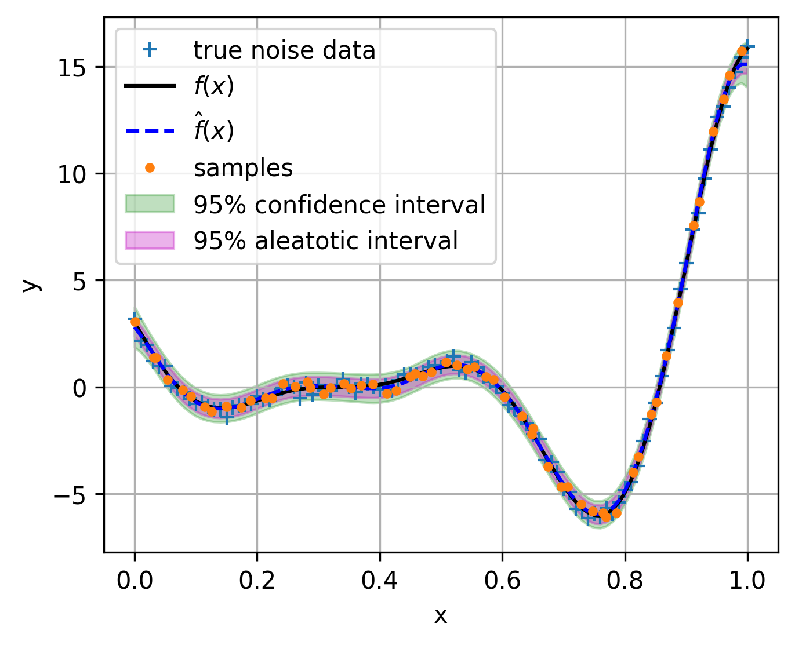

Single fidelity surrogates 
==========================

Surrogates is one of the most important part in the multi-fidelity optimization.
In this module, we implement the surrogates for single fidelity and multi fidelity.
For single fidelity, we implement the following surrogates:

Kriging model
-------------
Kriging model is a Gaussian process regression model with a constant mean function and a squared exponential kernel.
The Kriging model is implemented in :attr:`~mfpml.surrogates.sf_gpr.Kriging` class.

1. basics of Kriging model
~~~~~~~~~~~~~~~~~~~~~~~~~~~
A Gaussian process if completely specified by its mean function and \alert{correlation} function, which can be defined as:

.. math::

  m(\mathbf{x}) = \mathbb{E}\left [ f \left( \mathbf{x} \right) \right]

.. math::

  k(\mathbf{x}, \mathbf{x}') = \mathbb{E}\left [ (f (\mathbf{x}) - m(\mathbf{x}) )(f(\mathbf{x}') - m(\mathbf{x}'))\right]

Therefore, Gaussian process can be write as: 

.. math::

  f(\mathbf{x}) \sim  \mathcal{GP} (m(\mathrm{x}), k(\mathrm{x}, \mathrm{x}'))

Usually, the RBF kernel function is defined as:

.. math::
  
  k(\mathrm{x}^{i}, \mathrm{x}^{j}) = exp\left(-\sum_{d=1}^{k} \theta_d \left({x}_{d}^{i}-{x}_{d}^{j}\right)^{p_d}\right)

where :math:`k` is the dimension of the problem, :math:`\mathrm{\theta}`  and :math:`\mathrm{p}` are two :math:`k`-dimensional vectors of hyper-parameter
The correlation matrix is defined as:

.. math::

  \mathrm{K}(\mathrm{X,X}) = \begin{bmatrix}
  k(\mathrm{x}^{1}, \mathrm{x}^{1}) & ... & k(\mathrm{x}^{1}, \mathrm{x}^{n})\\
  ... & ... & ...\\
  k(\mathrm{x}^{n}, \mathrm{x}^{1})& ...& k(\mathrm{x}^{n}, \mathrm{x}^{n})
  \end{bmatrix}

where :math:`n` is the number of samples

2. Negative log-likelihood
~~~~~~~~~~~~~~~~~~~~~~~~~~
The negative log-likelihood of the Gaussian process is defined as:

.. math:: 
  \ln(L) =-\frac{n}{2}\ln(2\pi) - \frac{n}{2}\ln(\sigma_e^2) - \frac{1}{2}\ln|\mathbf{K}|  -\frac{(\mathbf{y}-\mathbf{1}\mu)^T\mathbf{K}^{-1}(\mathbf{y}-\mathbf{1}\mu)}{2\sigma_e^2}

in which, :math:`\mathbf{y}` is the vector of observations, :math:`\mathbf{1}` is a vector of ones, :math:`\mu` is the mean function, :math:`\sigma_e^2` is the variance of the noise, :math:`\mathbf{K}` is the correlation matrix.
Overall, it has 2n + 2 parameters to be optimized, furthermore, the hyper-parameters can be estimated with the following two steps:

(1) step 1: take derivative of the negative log-likelihood with respect to the hyper-parameters :math:`\mu` and :math:`\sigma_e^2` and set them to zero, we can get the following equations:

.. math::
  \hat{\mu} = \frac{\mathbf{1}^T\mathbf{K}^{-1}\mathbf{y}}{\mathbf{1}^T\mathbf{K}^{-1}\mathbf{1}}, \,\, \hat{\sigma_e}^2 =\frac{(\mathbf{y}-\mathbf{1}\mu)^T\mathbf{K}^{-1}(\mathbf{y}-\mathbf{1}\mu)}{n}

(2) step 2: substitute the estimated hyper-parameters into the negative log-likelihood, we can get the following equation:

.. math::
  \ln(L) = -\frac{n}{2} \ln(\hat{\sigma_e}^2) - \frac{1}{2} \ln |\mathbf{K}|

which can be optimized by optimization algorithms.

3. Inference
~~~~~~~~~~~~
The inference of the Gaussian process is defined as:

.. math::
  \begin{bmatrix}
            \mathbf{y} \\ \mathbf{y^{*}}
        \end{bmatrix} \sim N \left( \begin{bmatrix}
            m(X) \\ m(X^*)
        \end{bmatrix}, \begin{bmatrix}
            K(X,X) & K(X, X^*) \\ K(X^*, X) & K(X^*, X^*)
        \end{bmatrix} \right)

 Therefore, the predicted mean and variance can be calculated as:

.. math::
  \mathbf{y^*} = m(X^*) +  K(X^*, X)K(X,X)^{-1}(\mathbf{y} - m(X))

.. math::
  \mathbf{s^2}^* = \sigma_e^2\left(1-K\left( X^*, X\right )K\left(X,X\right)^{-1}K\left(X, X^*\right)  \right)

4. Implementation
~~~~~~~~~~~~~~~~~
The Kriging model is implemented in :attr:`~mfpml.surrogates.sf_gpr.Kriging` class. The following example is given to illustrate the usage of the Kriging model:

.. code-block:: python

  from mfpml.problem.single_fidelity_functions import Forrester
  from mfpml.surrogates.sf_gpr import Kriging

  problem = Forrester()

  # define sample points
  sample_x = np.array([0.0, 0.4, 0.6, 1.0]).reshape((-1, 1))
  test_x = np.linspace(0, 1, 1001, endpoint=True).reshape(-1, 1)

  # evaluate the function
  sample_y = problem.f(sample_x)
  test_y = problem.f(test_x)

  # define the Kriging model(usually design space is required)
  kriging = Kriging(design_space=problem._input_domain)
  # train the Kriging model
  kriging.train(sample_x, sample_y)
  # predict the mean and variance
  mean, var = kriging.predict(test_x,return_std=True)
  # plot the results
  fig, ax = plt.subplots(figsize=(5, 4))
  ax.plot(test_x, test_y, "k-", label=r"$f(x)$")
  ax.plot(test_x, sf_pre, "b--", label=r"$\hat{f}(x)$")
  ax.plot(sample_x, sample_y, "ro", label="samples")
  ax.fill_between(
      test_x.reshape(-1),
      (sf_pre - 1.96 * sf_std).reshape(-1),
      (sf_pre + 1.96 * sf_std).reshape(-1),
      alpha=0.25,
      color="g",
      label="95% confidence interval",
  )
  ax.legend(loc="best")
  ax.grid()
  plt.xlabel("x")
  plt.ylabel("y")
  plt.show()

.. image:: figures/kriging.png
   :width: 400
   :align: center
   :alt: pridiction of Kriging model

mix-kernel Kriging model
------------------------

1. basics of mix-kernel Kriging model
~~~~~~~~~~~~~~~~~~~~~~~~~~~~~~~~~~~~~

If we want to model a problem with noise within the outputs, where the problem can be formulated as:

.. math::
  y = f(x) + \epsilon

where :math:`\epsilon` is the noise, which is assumed to be a Gaussian distribution with zero mean and variance :math:`\sigma_a^2`.
Usually, this noise from data is called aleatory uncertainty, which is irreducible. So the mix-kernel Kriging model is proposed to model the aleatory uncertainty.
The essence of the mix-kernel Kriging model is to model the noise as a white noise process, which is defined as:

.. math::

  k(\mathrm{x}, \mathrm{x}') = \sigma_a^2 \delta(\mathrm{x}, \mathrm{x}')

Intuitively, the white noise Correlation matrix is a diagonal matrix with 
diagonal elements :math:`\sigma_a^2`

So the mix-kernel can be expressed as:

.. math::
  K_{mix}\left (\mathbf{X}, \mathbf{X} \right) =K_{RBF}\left (\mathbf{X}, \mathbf{X} \right)  + K_{noise}\left (\mathbf{X}, \mathbf{X} \right)

.. note::
  The mix-kernel Kriging model is implemented in :attr:`~mfpml.surrogates.sf_gpr.GaussianProcessRegressor` class.
  The hyper-parameter estimation and inference process of mix-kernel Kriging model is the same as the Kriging model, just the correlation matrix is different.
  replace the original correlation matrix with the mix-kernel correlation matrix.

2. Implementation
~~~~~~~~~~~~~~~~~
The mix-kernel Kriging model is implemented in :attr:`~mfpml.surrogates.sf_gpr.GaussianProcessRegressor` class.
the differential evolution algorithm made in the repo :attr:`~mfpml.optimization.evolutionary_algorithms.DE` is used 
for hyper-parameter estimation. The following example is given to illustrate the usage of the mix-kernel Kriging model:
  
.. code-block:: python

  from mfpml.models.sf_gpr import GaussianProcessRegressor
  from mfpml.optimization.evolutionary_algorithms import DE
  from mfpml.design_of_experiment.singlefideliy_samplers import LatinHyperCube

  # sampling 
  sampler = LatinHyperCube(design_space=func._design_space, seed=1)
  sample_x = sampler.get_samples(num_samples=60)
  test_x = np.linspace(0, 1, 101, endpoint=True).reshape(-1, 1)

  # get samples by adding noise to the true function
  sample_y = func.f(sample_x) + np.random.normal(0, 0.2,
                                                sample_x.shape[0]).reshape((-1, 1))
  test_y = func.f(test_x) + np.random.normal(0, 0.2,
                                            test_x.shape[0]).reshape((-1, 1))
  test_mean = func.f(test_x)

  # initialize optimizer
  optimizer = DE(num_gen=1000, num_pop=50, crossover_rate=0.5,
                strategy="DE/best/1/bin")

  # initialize the regressor
  sfK = GaussianProcessRegressor(
      design_space=func._input_domain, optimizer=optimizer)
  # train the model
  sfK.train(sample_x, sample_y)
  # get the prediction
  sf_pre, sf_std, aleatoric = sfK.predict(test_x, return_std=True)
  
  # plot the results
  fig, ax = plt.subplots(figsize=(5, 4))
  ax.plot(test_x, test_y, "+", label="true noise data")
  ax.plot(test_x, test_mean, "k-", label=r"$f(x)$")
  ax.plot(test_x, sf_pre, "b--", label=r"$\hat{f}(x)$")
  ax.plot(sample_x, sample_y, ".", label="samples")
  ax.fill_between(
      test_x.reshape(-1),
      (sf_pre - 1.96 * sf_std).reshape(-1),
      (sf_pre + 1.96 * sf_std).reshape(-1),
      alpha=0.25,
      color="g",
      label="95% confidence interval",
  )
  ax.fill_between(
      test_x.reshape(-1),
      (sf_pre - 1.96 * aleatoric).reshape(-1),
      (sf_pre + 1.96 * aleatoric).reshape(-1),
      alpha=0.3,
      color="m",
      label="95% aleatotic interval",
  )
  ax.legend(loc="best")
  ax.grid('--')
  plt.xlabel("x")
  plt.ylabel("y")
  plt.show()

